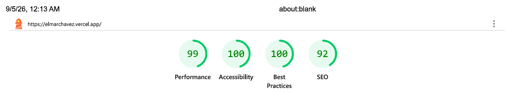

# Elmar Chavez - Web Portfolio

[](https://nextjs.org)
[](https://react.dev)
[](https://www.typescriptlang.org/)
[](https://tailwindcss.com)
[](https://vitest.dev)
[](https://playwright.dev)
[](https://github.com/features/actions)
[](https://vercel.com/)
[](/public/docs/lighthouse-report.pdf)


## Elmar Chavez | Full Stack Developer | [Live Site](https://elmarchavez.vercel.app)

A professional and modern web portfolio to showcase my projects, skills, and growth as a full stack developer.


---

## Table of Contents

- [Overview](#overview)
- [Features](#features)
- [Tech Stack](#tech-stack)
- [Project Structure](#project-structure)
- [Getting Started](#getting-started)
- [Testing Strategy](#testing-strategy)
- [Engineering Workflow](#engineering-workflow)
- [Quality Assurance](#quality-assurance)
- [Engineering Decisions](#engineering-decisions)
- [Future Improvements](#future-improvements)
- [Scripts](#scripts)
- [Author](#author)
- [License](#license)

---

## Overview

This is my professional web portfolio built with Next.js, TypeScript, and Tailwind CSS to showcase my work and experience as a full stack developer. It reflects the engineering practices I apply when building modern web applications.

Rather than emphasizing on complex animations, I intentionally focused on accessibility, semantic HTML, maintainable architecture, automated testing, and continuous integration. The result is a scalable, well-tested, and maintainable codebase that reflects the engineering practices I value as a software engineer.

---

## Features

### User Features

| Feature             | Description                                                                                                               |
| ------------------- | ------------------------------------------------------------------------------------------------------------------------- |
| Responsive Design   | Optimized layout for mobile, tablet, and desktop devices using a mobile-first approach.                                   |
| Theme System        | Supports light, dark, and system themes with persistent user preferences using `next-themes`.                             |
| Project Showcase    | Displays featured projects on the homepage and provides a dedicated `/projects` page for the complete project collection. |
| Experience Timeline | Highlights professional experience, freelance work, and certifications using a semantic timeline-inspired layout.         |
| Technical Blog      | Provides a dedicated `/blog` page and dynamic `/blog/[slug]` article pages powered by MDX.                                |
| External Profiles   | Provides quick access to GitHub, LinkedIn, Frontend Mentor, DEV Community, and Codewars.                                  |

### Engineering Highlights

| Feature                    | Description                                                                                                                                                 |
| -------------------------- | ----------------------------------------------------------------------------------------------------------------------------------------------------------- |
| Accessibility              | Built with semantic HTML, keyboard navigation, skip links, accessible names, and visible focus states for improved accessibility                            |
| Testing Strategy           | Comprehensive unit, integration, and end-to-end testing using Vitest, React Testing Library, and Playwright.                                                |
| Continuous Integration     | Automated linting, testing, coverage reporting, end-to-end testing, and production build verification using GitHub Actions.                                 |
| Feature-Based Architecture | Organized using reusable components, centralized data modules, shared TypeScript types, and reusable utilities for long-term maintainability.               |
| Code Quality               | Uses TypeScript, ESLint, Prettier, and consistent project organization to improve readability and maintainability.                                          |
| Content Architecture       | Separates structured portfolio metadata from long-form MDX content using centralized typed data, reusable utilities, and dynamic routes.                    |
| Performance Optimization   | Leverages Next.js `<Image>` and `<Link>` optimization, font optimization, SSR-safe theme handling, and responsive image loading for a fast user experience. |

---

## Tech Stack

**Libraries & Frameworks:** [](https://nextjs.org/)
[](https://react.dev/)
[](https://tailwindcss.com/)

**Languages:** [](https://www.typescriptlang.org/)
[](https://developer.mozilla.org/en-US/docs/Web/HTML)
[](https://developer.mozilla.org/en-US/docs/Web/CSS)
[](https://www.markdownguide.org/)

**Content:** [](https://mdxjs.com/)
[](https://tailwindcss.com/docs/typography-plugin)

**UI:** [](https://ui.shadcn.com/)
[](https://www.radix-ui.com/)
[](https://github.com/pacocoursey/next-themes)
[](https://lucide.dev/)
[](https://react-icons.github.io/react-icons/)

**Testing:** [](https://vitest.dev/)
[](https://testing-library.com/docs/react-testing-library/intro/)
[](https://playwright.dev/)

**Code Quality:** [](https://eslint.org/)
[](https://prettier.io/)
[](https://github.com/features/actions)

**Deployment:** [](https://vercel.com/)

---

## Project Structure

```text
elmarchavez/
├── .github/
│   └── workflows/              # GitHub Actions CI workflow
│
├── public/                     # Static assets
│   ├── docs/                   # Documentation and generated reports
│   ├── icons/                  # Application icons
│   ├── img/                    # Profile and portfolio images
│   └── projects/               # Project screenshots
│   └── favicon.ico             # Site favicon
│
├── src/
│   ├── app/                    # Next.js App Router
│   │   ├── blog/               # Dedicated blog page and dynamic article routes
│   │   └── projects/           # Dedicated projects page
│   │   ├── globals.css         # Global styles and theme variables
│   │   ├── layout.tsx          # Root application layout
│   │   └── page.tsx            # Homepage
│   ├── components/
│   │   ├── accessibility/      # Accessibility components (Skip Link, etc.)
│   │   ├── providers/          # Global React providers
│   │   ├── sections/           # Portfolio page sections
│   │   ├── theme/              # Theme system components
│   │   └── ui/                 # Reusable UI components
│   ├── content/
│   │   └── blog/               # MDX blog article content
│   ├── data/                   # Centralized portfolio and content metadata
│   ├── hooks/                  # Reusable React hooks
│   ├── lib/                    # Shared utility functions
│   ├── tests/                  # Unit and integration test helpers
│   └── types/                  # Shared TypeScript types
│   └── mdx-components.tsx      # Custom components for MDX content
│
├── tests/
│   └── utils/                  # Playwright testing utilities
│
├── .gitignore                  # Git ignore rules
├── .prettierignore             # Prettier ignore rules
├── .prettierrc                 # Prettier configuration
├── components.json             # shadcn/ui configuration
├── eslint.config.mjs           # ESLint configuration
├── LICENSE                     # MIT License
├── next.config.ts              # Next.js configuration
├── package-lock.json           # Dependency lockfile
├── package.json                # Project dependencies and scripts
├── playwright.config.ts        # Playwright configuration
├── postcss.config.mjs          # PostCSS configuration
├── README.md                   # You are here
├── setupTests.ts               # Vitest test setup
├── tsconfig.json               # TypeScript configuration
└── vitest.config.ts            # Vitest configuration
```

---

## Getting Started

### Prerequisites

- Node.js (v22 or later)
- npm (comes with Node.js)

### Installation

Clone the repository and install the project dependencies:

```bash
git clone https://github.com/CodingWithJiro/elmarchavez.git
cd elmarchavez
npm install
```

### Run the Development Server

Start the Next.js development server:

```bash
npm run dev
```

Then open your browser and visit:

```text
http://localhost:3000
```

---

## Testing Strategy

The project follows a multi-layered testing strategy to verify functionality, accessibility, and user interactions across different levels of the application.

| Test Type           | Purpose                                                                              | Tools                         |
| ------------------- | ------------------------------------------------------------------------------------ | ----------------------------- |
| Unit Tests          | Validate individual components, hooks, and data modules in isolation.                | Vitest, React Testing Library |
| Integration Tests   | Verify interactions between components and ensure sections render correctly.         | Vitest, React Testing Library |
| End-to-End Tests    | Simulate real user journeys such as theme switching, navigation, and external links. | Playwright                    |
| Accessibility Tests | Validate keyboard navigation, focus management, skip links, and accessible names.    | Playwright                    |

### Running Tests

Run the unit and integration test suite:

```bash
npm test
```

Generate a code coverage report:

```bash
npm run test:coverage
```

Run the end-to-end test suite:

```bash
npm run test:e2e
```

Launch the Playwright interactive UI:

```bash
npm run test:e2e:ui
```

Debug Playwright tests:

```bash
npm run test:e2e:debug
```

---

## Engineering Workflow

This project adapts professional team collaboration practices using **[feature-based branching workflow](https://github.com/CodingWithJiro/elmarchavez/network)** with descriptive commits and **[structured pull requests](https://github.com/CodingWithJiro/elmarchavez/pulls?q=is%3Apr+is%3Aclosed)**:

[](https://github.com/CodingWithJiro/elmarchavez/network)

---

## Quality Assurance

[](/public/img/lighthouse-report.png)

A **Google Lighthouse** audit was conducted on the final version of this project. You can view the **[full report here](/public/docs/lighthouse-report.pdf)**.

---

## Engineering Decisions

| Engineering Decision                   | Rationale                                                                                                                                                                     |
| -------------------------------------- | ----------------------------------------------------------------------------------------------------------------------------------------------------------------------------- |
| Foundation Before Features             | Established the project with TypeScript, Tailwind CSS, testing, linting, formatting, accessibility, and project tooling before implementing UI components.                    |
| SSR-Safe Theme Architecture            | Adopted `next-themes` with CSS variables to eliminate hydration mismatches while providing a scalable theme system.                                                           |
| Accessibility-First Development        | Incorporated semantic HTML, keyboard navigation, Skip Links, focus management, and accessible names throughout development instead of treating accessibility as a final step. |
| Data-Driven Rendering                  | Rendered projects, blog posts, experience, certifications, and social links from centralized typed data rather than hardcoded TSX.                                            |
| Separation of Content and Presentation | Centralized portfolio data in `src/data` and shared interfaces in `src/types` to improve maintainability and reduce duplication.                                              |
| Feature-Based Component Organization   | Organized components by responsibility to improve scalability and keep the codebase easier to navigate.                                                                       |
| Iterative UI Refinement                | Continuously refined layout hierarchy, responsive behavior, spacing, and content organization as the portfolio evolved.                                                       |
| Layered Testing Strategy               | Combined unit, integration, end-to-end, and accessibility testing to validate both implementation details and real user interactions.                                         |
| Meaningful Code Coverage               | Measured coverage on application-owned code instead of inflating metrics with third-party wrapper components or generated files.                                              |
| Continuous Integration                 | Automated linting, testing, production builds, and artifact generation using GitHub Actions to validate every change.                                                         |
| Structured Metadata + MDX Content      | Separated article metadata from long-form content so listing data remains structured while article content remains easy to author and maintain.                               |

---

## Future Improvements

| Improvement               | Description                                                                                                          |
| ------------------------- | -------------------------------------------------------------------------------------------------------------------- |
| Tech Stack Expansion      | Add a dedicated `/tech-stack` page and a "View all" entry point from the homepage Tech Stack section.                |
| Visual Regression Testing | Add screenshot-based testing to detect unintended UI changes.                                                        |
| Accessibility Auditing    | Integrate automated accessibility testing into the existing testing workflow.                                        |
| Performance Monitoring    | Continue optimizing bundle size and Core Web Vitals as the project grows.                                            |
| Expanded CI/CD            | Introduce additional GitHub Actions workflows such as dependency updates, security scanning, and automated releases. |
| Portfolio Growth          | Continue adding projects, articles, certifications, and professional experience.                                     |

---

## Scripts

The following scripts are available for local development, testing, and production builds.

| Script                   | Description                                                                |
| ------------------------ | -------------------------------------------------------------------------- |
| `npm run dev`            | Starts the Next.js development server with hot reloading.                  |
| `npm run build`          | Creates an optimized production build.                                     |
| `npm run start`          | Starts the production server after building the application.               |
| `npm run lint`           | Runs ESLint to identify code quality issues.                               |
| `npm test`               | Runs the Vitest unit and integration test suite.                           |
| `npm run test:coverage`  | Generates a code coverage report using Vitest.                             |
| `npm run test:e2e`       | Runs the Playwright end-to-end test suite.                                 |
| `npm run test:e2e:ui`    | Launches the Playwright interactive UI for developing and debugging tests. |
| `npm run test:e2e:debug` | Executes Playwright tests in debug mode with step-by-step inspection.      |

---

## Author

Created by: **Elmar Chavez** (CodingWithJiro)

Last updated: **September 2026**

[](https://elmarchavez.vercel.app)
[](https://www.linkedin.com/in/elmar-chavez/)
[](mailto:chavezelmar03@gmail.com)
[](https://github.com/CodingWithJiro)
[](https://www.frontendmentor.io/profile/CodingWithJiro)
[](https://app.daily.dev/elmarchavez)
[](https://dev.to/codingwithjiro)

## License

This project is licensed under the MIT License. See the [LICENSE](/LICENSE) file for details.
